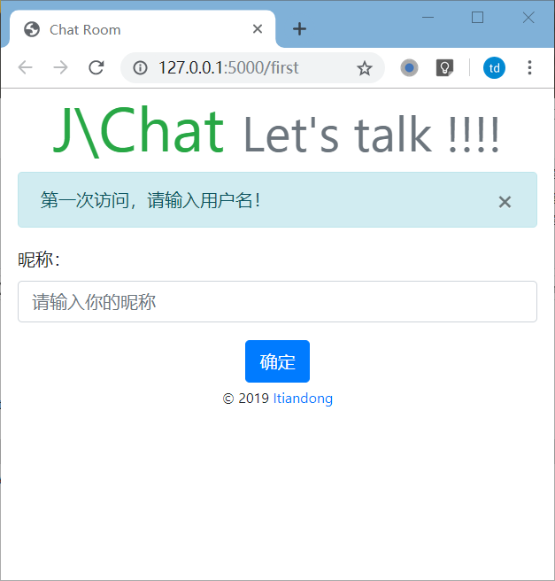
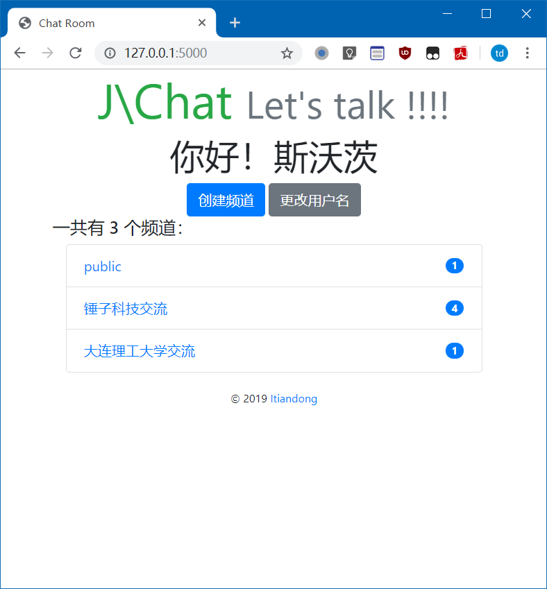
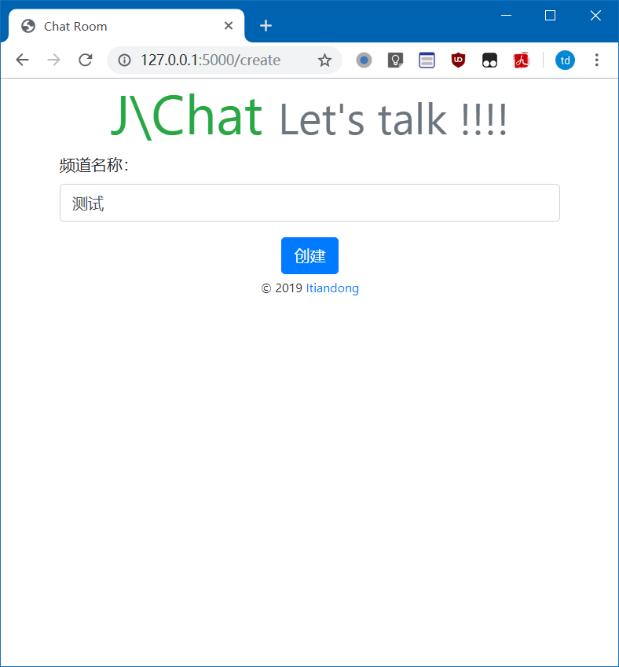
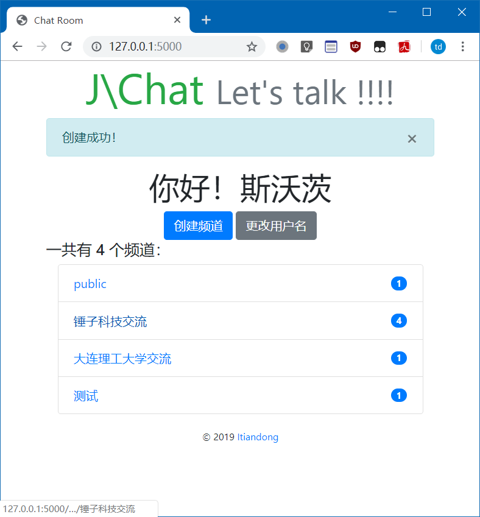
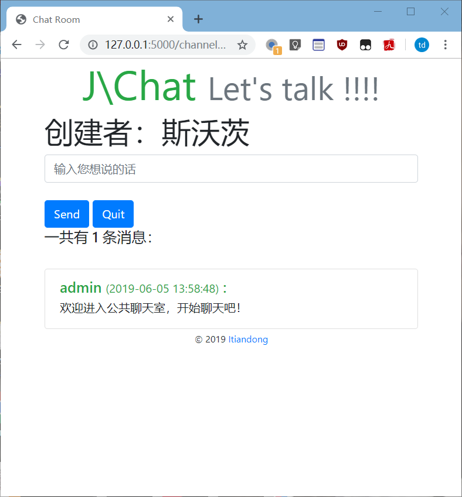
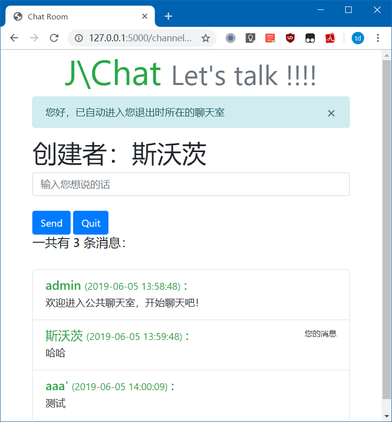
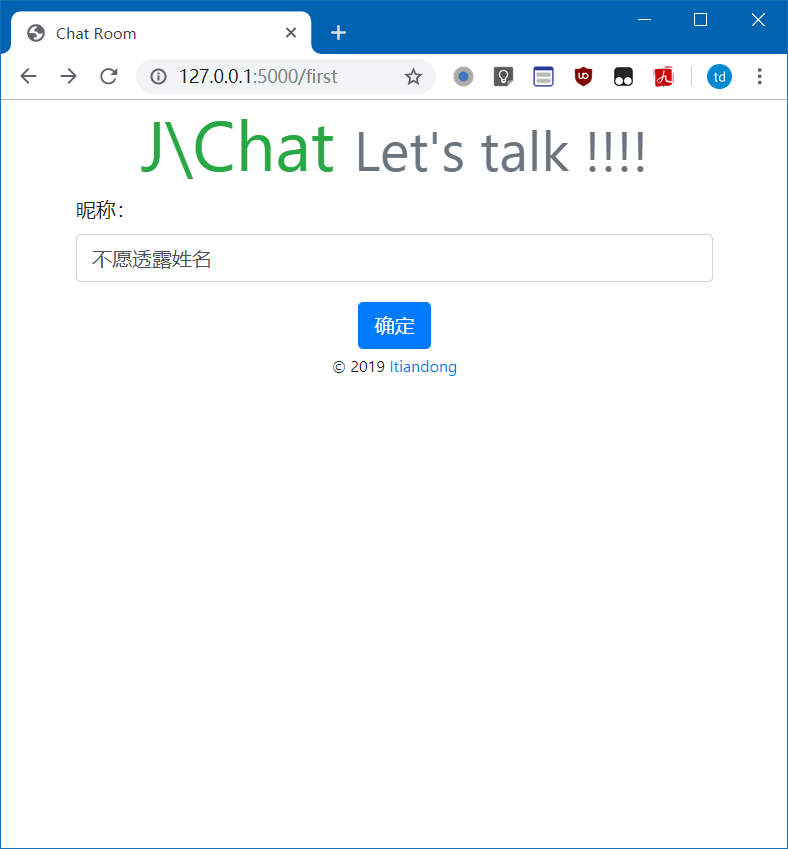
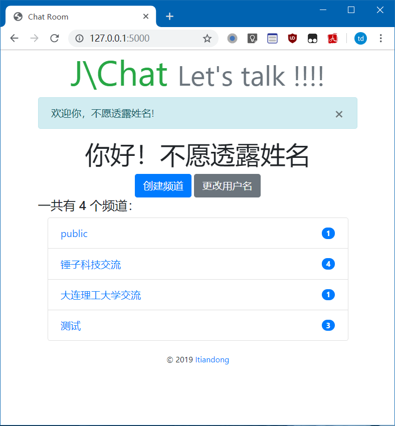

# Project 2

## structure

- app.py
- README.md
- tools.py 工具模块，内有获取当前时间函数
- static/ css 和 js
- templates/ jinja 模板

## images

### 首次访问提示输入昵称

### 主界面

### 创建频道

### 频道页面

（奇淫巧技使得支持中文 encode decode ..）

### 记住上次访问的聊天室

### 改名

